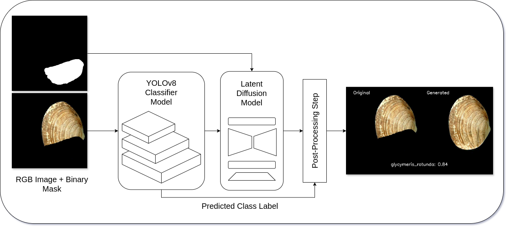
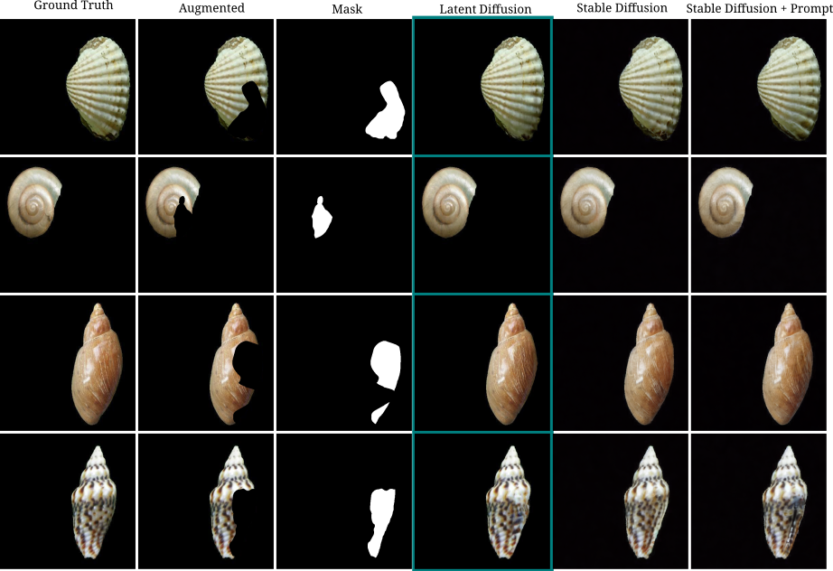
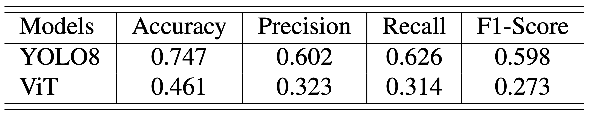
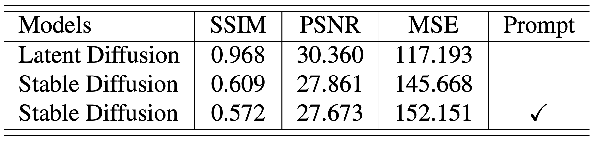

ShellVis: Seashell Classification and Restoration Model
---



*Abstract:*

Seashell image reconstruction is a valuable technique that
can provide insights into seashell species, subspecies, and
their environmental and ecological contexts. In this paper,
we propose a novel two-stage network to aid in classifying seashells by species and image inpainting to visualise
the possible complete shell structure. In the first stage, the
image reconstruction phase, latent diffusion is used to reconstruct the missing parts of a shell using the binary mask
as a guide. The second stage, Latent Stable Diffusion, is
applied to the reconstruction of the missing part of the shell
using a binary mask. In our comparative analysis, we employed the Vision Transformer (ViT) model to benchmark
classification performance across tasks. The results demonstrate the superior performance of YOLOv8 over ViT on the
testing subset of our dataset, achieving 75% accuracy for
classification tasks and a Structural Similarity Index (SSIM)
score of 96% (0.968), the highest Peak Signal-to-Noise Ratio
(PSNR) at 30.360, and the lowest Mean Squared Error (MSE)
at 117.193 for shell reconstruction. Moreover, we present
a comparison between our model and the Latent and Stable diffusion models, demonstrating the effectiveness of our
framework within the broader context of existing methods.
Overall, the proposed model presents a promising approach
to seashell image reconstruction and classification that has
significant implications for marine biology and conservation.

#### Preliminary Results:



#### Classification Task



#### Inpainting Task



## Dataset

We used the seashell images in dataset from Qi Zhang et al. paper " A shell dataset, for shell features extraction and recognition".
You can find the full dataset [here](https://springernature.figshare.com/articles/dataset/all_shell_images/9122621?backTo=/collections/A_shell_dataset_for_shell_features_extraction_and_recognition/4428335). You can find their paper [here](https://www.nature.com/articles/s41597-019-0230-3).

We are cultivating our own dataset called "Shells in the Wild" that contain whole and broken seashells. You can find
our dataset [here](https://huggingface.co/datasets/DS-77/Shells_in_the_Wild/).

---

## How to install ShellVis

1) Clone this repository in your chosen directory.
2) Create a conda environment for ShellVis: `conda create --name <my-env>` or `conda env create -n shellvis -f environment.yaml`
4) Install the YOLO8 library from the platform Ultralytics using pip: `pip install ultralytics` or use pip to install it from their repository: `pip install git+https://github.com/ultralytics/ultralytics.git@main` 
5) Inside the ShellVis, download the Latent Diffusion Repository from CompVis/latent-diffusion: `git clone https://github.com/CompVis/latent-diffusion.git`
6) Install the needed dependencies for Latent Diffusion. Follow the directions provided by the official repo [here](https://github.com/CompVis/latent-diffusion).

---

## How to run ShellVis

To run ShellVis with the sample images:

```commandline
python shellvis_main.py -i Example_Image/inpainting_sample/Glycymeris_rotunda_5_A_missing_20p.png -m Example_Image/inpainting_sample/Glycymeris_rotunda_5_A_missing_20p_mask.png
```

---

## Troubleshooting
All common issues will be posted here with their corresponding solutions. If you run into any errors, feel free to open an issue. We'll do our best to help you resolve it.

---

## Credit
This repository contains code from the Latent Diffusion and YOLOv8 repository.